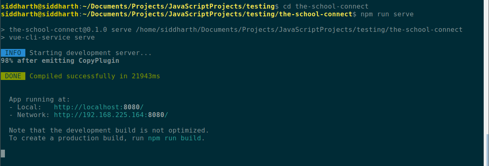

# The School Connect Project Documentation

## Setup

A lot of the project was built on Ubuntu, a Linux distribution but this guide assumes that you have a Windows OS (any version should work), a working browser, command prompt (or terminal) and a knowledge of how directory path works (won't need it much, but still helpful!). Also, it'll be a good idea to use a text editor. I've used Sublime Text for the project. Do note that the screenshots are from Linux but you should have no trouble following them. 

Also, install NodeJS on your system which should install NPM automatically. 
Link to install NodeJS: https://nodejs.org/en/
I recommend installing the LTS.

## Getting started

The project is made in VueJS, the JavaScript framework. You need to first install the VueJS package into your system using NPM (Node Package Manager). First, check your version of NPM usign the command line:
```
npm --version
```
If it gives a reply, your NodeJS installed succesfully. If it didn't, it's vital you do it now.

Now, install VueJS v3 on your computer using the command:
```
npm install -g @vue/cli
```

Check your VueJS version:
```
vue -V
```
If the result is 3.x or greater, go right ahead. If it's giving unexpected results, try re-installing Vue.

Now that the installation has been dealt with, go ahead and create a new Vue app using the command:
```
vue create the-school-connect
```
It should give you a menu based selection system where you can go ahead and select vue-router, vuex, node-sass, babel and eslint.


After that change the directory to the newly created directory named after the app.

```
cd the-school-connect
```

Then, to get a live preview of the app, run the command:

```
npm run serve
```



If you check the code using a text editor, you'll see a pre-made boilerplate code. Check the browser as well. A localhost should open up which look more or less like this.


For now, let's not tamper with the boilerplate code. We'll do that soon.

Now, we need to install Vuetify, the material design framework used in this project.

```
vue add vuetify
```


Next, let's install Google's Firebase and save it as a dependency.

```
npm install --save firebase
```


Perfect! Let's start with the UI now.

## The User Interface

We have now configured the entire app according to our dependencies, so now let's start with our front end.

Before we do that, here's a small explanantion of the file structure used by VueJS.

```
the-school-connect
|| node_modules
|| public
	|+ favicon.ico
	|+ index.html
|| src
	|| assets
		|+ logo.png
		|+ logo.svg
	|| components
		|+ HelloWorld.vue
	|| plugins
		|+ vuetify.js
	|| router
		|+ index.js
	|| store
		|+ index.js
	|| views
		|+ About.vue
		|+ Home.vue
	|+ App.vue
	|+ main.js
|+ .browserlistrc
|+ .eslintrc.js
|+ .gitignore
|+ babel.config.js
|+ package-lock.json
|+ package.json
|+ README.md
|+ vue.config.js
```

`App.vue` is the main vue file in the entire project. The other vue files are in the folders `components` and `views`.

**Brief explanation on what the folders `components` and `views` actually are.** Views are used to design the pages on the front-end while components are used to design specific components like a navigation bar component. We will not be using much of `components` in the project.

Now we'll clean up the code in all the files in `views` folder and `App.vue` so that it looks pretty much like this:

```
<template>
  <v-app>
    <v-app-bar
      app
      color="primary"
      dark
    >
      
    </v-app-bar>

    <v-content>

    </v-content>
  </v-app>
</template>

<script>

export default {
  name: 'App',

  components: {
    
  },

  data: () => ({
    //
  }),
};
</script>
```

Clean up the other files in the same way.

Now we need to start by creating the navigation bar of the app and work on the router. We'll need an icon on the left side of the navigation bar with three dashes to indicate the presence of a navigation drawer. Next, we'll need the text which shows us the name of the app. Now, leaving some space in the middle, we'll need a bunch of buttons with various requirements. 

The icon on the left will only be visible if the device is small. The group of buttons on the left will be invisible on smaller devices. We'll be using some CSS helper classes from Vuetify for this.

```
<!-- App.vue template -->

<v-app-bar app class="primary">
      <v-app-bar-nav-icon
        class="hidden-sm-and-up"
        @click.stop="drawer = !drawer"
      ></v-app-bar-nav-icon>

      <v-toolbar-title>
        <router-link to="/">
          <span class="grey--text text--lighten-2 display-1">THE</span>
          <span class="black--text text--lighten-2 display-1">SCHOOL</span>
          <span class="grey--text text--lighten-2 display-1">CONNECT</span>
        </router-link>
      </v-toolbar-title>

      <v-spacer></v-spacer>

      <v-toolbar-items class="hidden-xs-only">
        <v-btn router to="/signup" link depressed large class="primary">
          <v-icon left>mdi-traffic-light</v-icon>
          Sign Up
        </v-btn>
        <v-btn to="/signin" link depressed large class="primary">
          <v-icon left>mdi-account</v-icon>
          Sign In
        </v-btn>
        <v-btn depressed large class="primary" @click="signOut">
          <v-icon left>mdi-logout</v-icon>
          Sign Out
        </v-btn>
      </v-toolbar-items>
    </v-app-bar>

    <v-navigation-drawer v-model="drawer" app>
      <v-list>
        <v-list-item link router to="/signup">
          <v-list-item-icon>
            <v-icon>mdi-traffic-light</v-icon>
          </v-list-item-icon>
          <v-list-item-content>
            <v-list-item-title>Sign Up</v-list-item-title>
          </v-list-item-content>
        </v-list-item>
        <v-list-item link router to="/signin">
          <v-list-item-icon>
            <v-icon>mdi-account</v-icon>
          </v-list-item-icon>
          <v-list-item-content>
            <v-list-item-title>Sign In</v-list-item-title>
          </v-list-item-content>
        </v-list-item>
        <v-list-item link router @click="signOut">
          <v-list-item-icon>
            <v-icon>mdi-logout</v-icon>
          </v-list-item-icon>
          <v-list-item-content>
            <v-list-item-title>Sign Out</v-list-item-title>
          </v-list-item-content>
        </v-list-item>
      </v-list>
    </v-navigation-drawer>
```

```
<!-- App.vue data() inside <script> tag -->

data: () => ({
  drawer: false
}),
```

The navigation bar should look sleek now. Here's a picture of it from a desktop browser.


Here's how it looks on a mobile phone device.


**Now that the nav bar is working, we need to create the other important views.**


